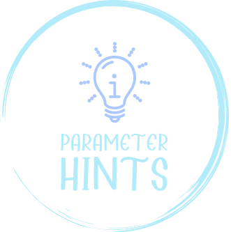

<p align="center">

</p>
<p align="center"> <a href="./README.md">English</a> | 简体中文</p>

**Warning:** 由于[DominicVonk/VSCode-Parameter-Hints](https://github.com/DominicVonk/VSCode-Parameter-Hints)不再继续维护了，我决定fork下来继续维护


显示被调用函数的参数名称

&nbsp;
&nbsp; 

## 支持的语言 *
- Javascript
- Javascript React
- Typescript
- Typescript React
- PHP
- Vue

&nbsp; 
\* _Feel free to contribute_

&nbsp;
&nbsp; 

## Settings

|Name|Description|Default|
---|---|---
|`parameterHints.enabled`|Enable Parameter Hints|`true`|
|`parameterHints.hintingType`|Enable Parameter Hints Type|`variableAndType`|
|`parameterHints.languages`|Enable Parameter Hints only for the selected languages|`all`|
|`parameterHints.padding`|Padding|`1 4`|
|`parameterHints.margin`|Margin|`0 1`|

&nbsp;
&nbsp;

## 颜色

The background and foreground colors can be customized under 
`workbench.colorCustomizations` like this:

```js
// settings.json
{
    // ...
    "workbench.colorCustomizations": {
        "parameterHints.hintBackground": "#37415180",
        "parameterHints.hintForeground": "#9CA3AF"
    },
}
```

| Name | Description |
---|---
|`parameterHints.hintForeground`|Specifies the foreground color for the hint|
|`parameterHints.hintBackground`|Specifies the background color for the hint|

&nbsp;
&nbsp;

## 指令

|Name|Description|
---|---
|`parameterHints.toggle`|Hide / Show Hints|

&nbsp;
&nbsp;

## Credits
[Dash-AST](https://github.com/goto-bus-stop/dash-ast)
[TypeScript](https://github.com/microsoft/typescript/)
[php-parser](https://github.com/glayzzle/php-parser)

## :coffee:

[请我喝一杯咖啡](https://github.com/Simon-He95/sponsor)

## License

[MIT](./license)
